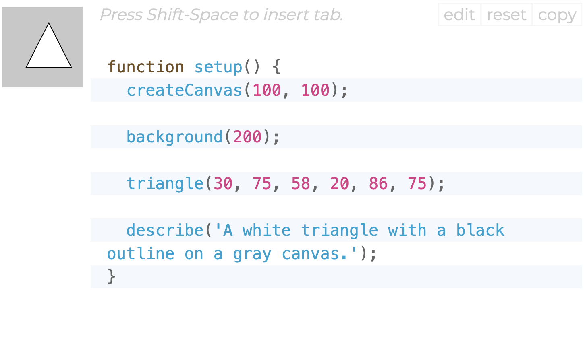
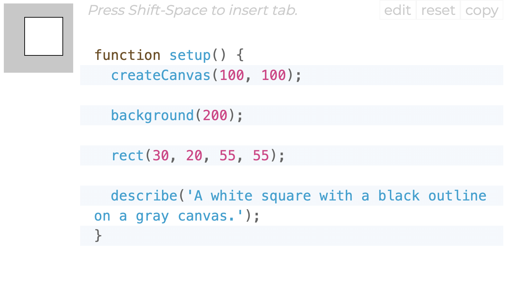

># pwan0722_9103_tut5 Week 8 Quiz 

## **Part1: Image Technique Inspiration**
This artist creates through the use of color and abstract shapes. I think this work can be made more gorgeous through programming on the original basis. Her works use a variety of simple shapes and lines, which also meet the requirements of the assignment.The combination of colors is also one of the characteristics of her works.

## **Part2:Coding Technique Exploration**

In order to achieve the effect produced in the picture, I think it can be achieved using a combination of [triangle](https://p5js.org/reference/#/p5/triangle) and [rectangles](https://p5js.org/reference/#/p5/rect). Each row consists of a sequence of five triangles, separated by vertical rectangles.

